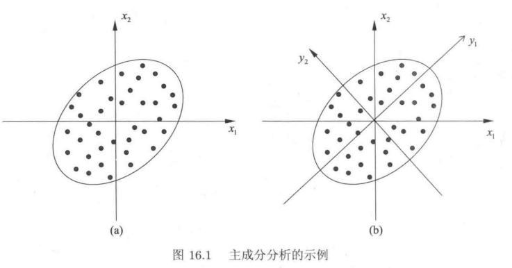
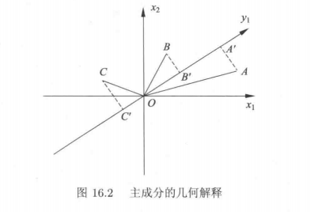

# 主成分分析|机器学习方法（李航）

主成分分析是利用正交变换把由线性相关变量表示的观测数据转换为少数几个由线性无关变量表示的数据，线性无关的变量称为主成分。主成分的个数通常小于原始变量的个数，所以主成分分析属于降维方法。

# 基本想法

主成分分析中，首先对给定数据进行规范化，使得数据每一变量的平均值为0，方差为1。之后对数据进行正交变换，原来由线性相关变量表示的数据，通过正交变换变成由若干个线性无关的新变量表示的数据。新变量是可能的正交变换中变量的方差的和（信息保存）最大的，方差表示在新变量上信息的大小。将新变量依次称为第一主
成分、第二主成分等。这就是主成分分析的基本思想。

通过主成分分析，可以利用主成分近似地表示原始数据，这可理解为发现数据的“基本结构”；也可以把数据由少
数主成分表示，这可理解为对数据降维。

书中的例子，数据集在由$x_1$和$x_2$相交的坐标中（下图左侧）。接着对坐标进行正交变换，反应到坐标系中，就是对坐标进行旋转（下图右侧），旋转后得到的坐标用$y_1$和$y_2$表示。

要旋转多少度才停止？第一主成分需要对应方差最大的方向，在上图就是椭圆的长轴，即$y_1$，第二主成分需要与$y_1$正交，且方差第二大的方向，在图中就是$y_2$。

这样，就得到了经过正交变换后的新特征，完成了主成分分析。得到的新变量是线性无关的，比如知道了$y_1$的值，对$y_2$的取值是没有影响的，反之亦然。

上面说到主成分分析属于降维方法。将新特征中最小方差的特征（$y_2$）投影到最大方差特征的轴上（$y_1$），这样就完成了降维。

对方差最大做出解释

在对原始坐标进行旋转后得到一个新的坐标轴$y_1$，数据点A，B和C在$y_1$上的投影为A'，B'和C'，原点到投影点的距离平方和可以代表在该方向上方差的大小，因此我们需要选择一个方向，让$OA'^2+OB'^2+OC'^2$最大。

根据勾股定理，我们可以得知让$OA'^2+OB'^2+OC'^2$最大等价于让$AA'^2+BB'^2+CC'^2$最小，这样，得到的第一个轴就可以作为第一主成分。

## 定义

$x=(x_1,x_2, \cdots , x_m)^T$是m维随机变量，其均值向量是$\mu$
$$
\mu=E(x)=(\mu_1,\mu_2, \cdots,\mu_m)^T
$$
协方差矩阵为$\Sigma$
$$
\Sigma = \operatorname { cov } ( x , x ) = E [ ( x - \mu ) ( x - \mu ) ^ { T } ]
$$
考虑由m维随机变量x到m维随机变量$y=(y_1,y_2, \cdots , y_m)^T$的线性变换
$$
y _ { i } = \alpha _ { i } ^ { T } x = \alpha _ { 1 i } x _ { 1 } + \alpha _ { 2 i } x _ { 2 } + \cdots + \alpha _ { m i } x _ { m }
$$
其中 $𝛼_𝑖^𝑇$ 是系数向量
$$
\alpha _ { i } ^ { T } = ( \alpha _ { 1 i } , \alpha _ { 2 i } , \cdots , \alpha _ { m i } ) , \quad i = 1,2 , \cdots , m
$$
由随机变量的性质可知，
$$
\left. \begin{array} { c } { E ( y _ { i } ) = \alpha _ { i } ^ { T } \mu , \quad i = 1 , 2 ,  \cdots , m } \\ 
var(y_i) = a_i^T\Sigma a_i, i = 1,2,\cdots,m \\
{ \operatorname { cov } ( y _ { i } , y _ { j } ) = \alpha _ { i } ^ { T } \Sigma \alpha _ { j } , \quad i = 1 , 2 , \cdots , m ;\quad j = 1,2 , \cdots , m } \end{array} \right.
$$
如果满足以下条件：

1. 系数向量$a_i^T$是单位向量，即$a_i^Ta_i=1,i=1,2,\cdots,m$，$a_1,a_2,\cdots,a_m$是其一组标准正交基：
   $$
   \alpha _ { i } ^ { T } \alpha _ { j } = \left\{ \begin{array} { l l } { 1 , } & { i = j } \\ { 0 , } & { i \neq j } \end{array} \right.
   $$
   
2.  变量$y_i$与$y_j$互不相关，即$cov(y_i, y_j) = 0 (i \neq j)$

3. $y_i$是与$y_1, y_2, \cdots, y_{(i-1)} (i=1, 2, \cdots, m）$都不相关的x的所有线性变换中方差最大的，比如$y_1$是所有线性变换中方差最大的，$y_2$是与$y_1$不相关的x的所有线性变换中方差最大的，这时分别称$y_1, y_2, cdots, y_m$为的第一主成分，第二主成分，…，第m主成分。

其中条件2和3给出了一个求主成分的方法：在第K步，在与 $\alpha _ { 1 } ^ { T }x, \alpha _ { 2 } ^ { T }x, \cdots, \alpha _ { k-1 } ^ { T }x$不相关的x的所有线性变换

$$
\alpha _ { k } ^ { T } x = \sum _ { i = 1 } ^ { m } \alpha _ { i k } x _ { i }
$$

   中，在 $a_k^Ta_k=1$的条件下，求方差最大的，得到x的第k主成分。

## 主要性质
