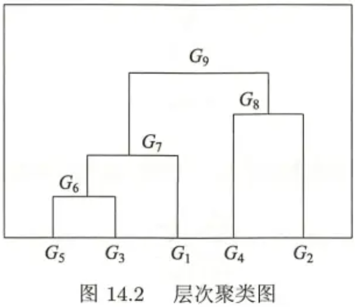

# 聚类
商城网站想做一个推荐的系统。我们的想法是“物以类聚，人以群分”。例如你将鸡翅、木炭、竹签加入了购物车，我们将你和同样购买了鸡翅、木炭、竹签的用户归为一类，然后这一类用户还购买可乐、啤酒、烧烤的调味料，我们可以将这些商品推荐给你。

根据上面的想发，我们知道聚类的步骤：

* 计算样本的之间的相似度：商城的用户有点只买了鸡翅，或者买了鸡翅和木炭，又或者三个商品都买了、三个都没买，那么用户之间的相似度分别为33%、66%、100%、0%。
* 根据相似度将样本分类：按照100%的相似度分类，模型的拟合度太高。按照33%的相似度分类，模型的拟合度太低。我们需要找到一个合适相似度将样品分类。

# 相似度
相似度除了可以用的欧式距离来计算，也可以使用其它方法计算。

## 距离
对于n个样本，每个样本由m个属性的特征向量组成，样本集合可以用矩阵X表示：
$$
X=[x_{ij}]_{m \times n} = \begin{bmatrix}
x_{11} & x_{12} & \cdots & x_{1n} \\
x_{21} & x_{22} & \cdots & x_{2n} \\
{\vdots}&{\vdots}& &{\vdots}\\
x_{m1} & x_{m2} & \cdots & x_{mn} \\
\end{bmatrix}
$$
这里列表示的是所有样本的一个特征的特征值，行表示的是一个样本的每个特征的特征值。第$j$个样本的第$i$个特征值，可以用$x_{ij}$表示。

这里使用马哈拉诺比斯距离（马氏距离），因为马氏距离考虑的是各个特征之间的相关性，与各个分量的尺度无关。

马氏距离的定义：
$$
d_{ij}=[(x_i-x_j)^TS^{-1}(x_I-x_j)]^{\frac{1}{2}}
$$
其中：
$$
x_{i}=\left(x_{1 i}， x_{2 i}， \cdots， x_{m i}\right)^{\mathrm{T}}， \quad x_{j}=\left(x_{1 j}， x_{2 j}， \cdots， x_{m j}\right)^{\mathrm{T}}
$$
S是协方差矩阵，所谓协方差，是统计学上用于统计两个变量的总体误差的一种方法，方差是协方差的一种特殊情况，协方差矩阵是将所有变量进行两两计算，并以矩阵的方式进行存储。

方差：
$$
\operatorname{Var}(X)=\frac{\sum_{i=1}^{n}\left(x_{i}-\bar{x}\right)\left(x_{i}-\bar{x}\right)}{n-1}
$$
协方差：
$$
\operatorname{Cov}(X， Y)=\frac{\sum_{i=1}^{n}\left(x_{i}-\bar{x}\right)\left(y_{i}-\bar{y}\right)}{n-1} 
$$
对于两个变量$X_1$和$X_2$，它们的协方差矩阵是：
$$
\operatorname{Cov}(Z)=\left[\begin{array}{lll}\operatorname{Cov}(X 1， X 1) & \operatorname{Cov}(X 1， X 2) \\ \operatorname{Cov}(X 1， X 2) & \operatorname{Cov}(X 2， X 2)\end{array}\right]
$$

## 相关系数

样品间的相似度也可以用相关系数来表示。相关系数越接近1，样本越相似，越接近0，样本越不相似。

相关系数：
$$
r_{i j}=\frac{\sum_{k=1}^{m}\left(x_{k i}-\bar{x}_{i}\right)\left(x_{k j}-\bar{x}_{j}\right)}{\left[\sum_{k=1}^{m}\left(x_{k i}-\bar{x}_{i}\right)^{2} \sum_{k=1}^{m}\left(x_{k j}-\bar{x}_{j}\right)^{2}\right]^{\frac{1}{2}}} 
$$
其中：
$$
\bar{x}_{i}=\frac{1}{m} \sum_{k=1}^{m} x_{k i}， \bar{x}_{j}=\frac{1}{m} \sum_{k=1}^{m} x_{k j}
$$

## 夹角余弦

样本之间的相似度也可以用夹角余弦来表示。越接近1，表示样本越相似，越接近0，表示样本越不相似。

夹角余弦：
$$
s_{i j}=\frac{\sum_{k=1}^{m} x_{k i} x_{k j}}{\left[\sum_{k=1}^{m} x_{k i}^{2} \sum_{k=1}^{m} x_{k j}^{2}\right]^{\frac{1}{2}}}
$$
不同的用来判断样本相似度的依据的结果可能不同，在计算距离时较小，相似度较大，但是计算相关系数时可能也较小，则相似度较小。

# 类或簇

有了判断样本间相似度的方式后，我们可以对每个样本进行分类，每个样本只能属于一个类的方法叫硬聚类，如果一个样本可以属于多个类，则称之为软聚类，我们只考虑硬聚类。

我们现在在数学上来看怎样的样本属于同一类。

对于一个给定的正数T，若样本集合G中任意两个样本$x_i$和$x_j$，有：
$$
d_{ij} \leq T
$$
上式中$d_{ij}$为距离，若符合上式，称这个样本集合G为一个类或簇。

设定的正数T实际上是一个阈值，我们采用距离作为判断样本相似度的依据，那么当距离小于一个阈值时，说明两个样本相似度较大，可以分为一个类，那么对于有多个样本的集合G来说，如果G中所有的样本两两之间的距离都小于T，说明它们之间的相似度都较大，因此可以把所有样本都归为一类，那么整个样本集合G即为这一类。

定义为类G中样本的个数，于是可以得到类的均值，又称为类的中心：
$$
\bar{x}_{G}=\frac{1}{n_{G}} \sum_{i=1}^{n_{G}} x_{i}
$$
我们将类G中每个样本两两之间的距离计算出来，并取最大的距离作为类G的直径：
$$
D_{G}=\max _{x_{i}， x_{j} \in G} d_{i j}
$$
可以通过散布矩阵计算协方差矩阵：
$$
A_{G}=\sum_{i=1}^{n_{G}}\left(x_{i}-\bar{x}_{G}\right)\left(x_{i}-\bar{x}_{G}\right)^{\mathrm{T}} \\
S_{G}=\frac{1}{m-1} A_{G}
$$

## 类间距

定义两个类$G_p$和$G_q$之间的距离为$D(p, q)$，也称为连接。但是对于$D(p, q)$的定义又有多种，对于不同的定义，$D(p, q)$的计算方法不同。

如果定义两个样本之间的最短距离为D，称之为最短距离或单连接：
$$
D_{p q}=\min \left\{d_{i j} \mid x_{i} \in G_{p}，  x_{j} \in G_{q}\right\}
$$
最短距离是指两个类中各找到一个样本点，使这两个样本点之间的距离最短。

与最短距离对应的为最长距离，或完全连接：
$$
D_{p q}=\max \left\{d_{i j} \mid x_{i} \in G_{p}， x_{j} \in G_{q}\right\}
$$
容易理解，最长距离是指两个类中各找到一个样本点，使这两个样本点之间的距离最短。

如果定义两个类的中心之间的距离为D，则为中心距离：
$$
D_{p q}=d_{\bar{x}_{p} \bar{x}_{q}}
$$
定义任意两个样本之间的距离的平均值为两个类的距离D，则称之为平均距离：
$$
D_{p q}=\frac{1}{n_{p} n_{q}} \sum_{x_{i} \in G_{p}} \sum_{x_{j} \in G_{q}} d_{i j}
$$
显然平均距离中需要累加两次，对于其中一个类的每一个样本点，都需要遍历一遍另一个类的每个样本点，计算量较大。

# 层次聚类

层次聚类假设类别之间存在层次结构，将样本聚到层次化的类中。

层次聚类又有聚合和分裂两种方法。

聚合聚类将每个样本分为一类，并计算每个样本两两之间的距离，将距离最近的两个类合并为一个新的类，此时需要计算新类与其它类之间的距离，并在所有距离中再选出距离最短的两个类进行合并，重复此操作直到满足停止条件。聚合聚类又可以叫做自下而上聚类

分类聚类将所有的类分为一个类，然后将距离最远的两个类分成两个新的类，重复操作直到满足停止条件。分类聚类又称为自上而下聚类。

聚合聚类需要预先确定三个要素：距离或相似度，合并规则和停止条件。

距离可以用上面介绍过的闵可夫斯基距离，马哈拉诺比斯距离、相关系数、夹角余弦等。合并规则指以什么样的类间距最小作为合并的指标，类间距就是上面介绍过的最短距离、最长距离、中心距离、平均距离，停止条件可以是类的个数达到一个阈值，或者类的直径超过阈值等。

# k均值聚类

K均值聚类将样本划分为k个子集（类），每个类中的样本到其所属类的中心的距离最短，k均值聚类属于硬聚类。

## k均值算法思想

样本集合$X={x_1, x_2, \cdots, X_n}$，每个样本的特征向量维数为m，k个类$G_1, G_2, \cdots, G_k$形成对样本集合X的划分，其中$ G_{i} \cap G_{j}=\emptyset $表示两个类的交集为空集，即每个样本只属于一个类，且$\cup_{i=1}^{k}  G_{i}=X $ ，表示所有的类中的样本的并集为样本集合X，即每个样本都要被分为一个类。

我们可以将每一个样本用一个整数i表示，$i\in {1, 2, \cdots, n}$，每个类用一个整数l表示，$l\in{1, 2, \cdots, k}$，那么我们可以用划分C表示每个样本属于哪个类，即$l=C(i)$。这个函数C是一个从样本到类的函数。

K均值聚类采用欧式距离平方作为样本之间的距离，用$d(x_i, x_j)$表示：
$$
\begin{aligned} d\left(x_{i}， x_{j}\right)
=& \sum_{k=1}^{m}\left(x_{k i}-x_{k j}\right)^{2} \\
=&\left\|x_{i}-x_{j}\right\|^{2} \end{aligned}
$$
上式表示对两个样本之间的特征相减后平方再相加，比如$x_1$的特征向量为$(2, 3)$，$x_2$的特征向量为$(-1, 4)$，则$d(x_1, x_2) = (2 – (-1))^2 + (3 – 4)^2 = 9 + 1 = 10$。

K均值的损失函数为样本与其所属类的中心之间的距离的总和：
$$
W(C)=\sum_{l=1}^{k} \sum_{c(i)=l}\left\|x_{i}-\bar{x}_{l}\right\|^{2}
$$
比如有两个类$G_1$和$G_2$，有3个样本分到$G_1$，4个样本分到$G_2$，对于$G_1$中的3个样本，首先计算它们的中心，接着计算3个样本到它们的中心的距离并相加，就得到$G_1$中样本与$G_1$的中心之间的距离，对于$G_2$的4个样本也进行同样的操作，最后将每个类的该数值都相加，即得到$W(C)$。

现在，我们要最小化损失函数，并求得最优划分C*：
$$
C^{*} =\arg \min _{C} W(C) \\=\arg \min _{C} \sum_{l=1}^{k} \sum_{c(i)=l}\left\|x_{i}-\bar{x}_{l}\right\|^{2}
$$
但是，对于n个样本分到k个类的问题，可能的划分方法的数量为：
$$
S(n， k)=\frac{1}{k !} \sum_{l=1}^{k}(-1)^{k-l}\left(\begin{array}{l}k \\ l\end{array}\right) k^{n}
$$

## k均值算法

K均值的迭代算法中，每次迭代都包含两个步骤，首先我们可以随机选择k个类的中心的位置，将样本分到距离其最近的中心所对应的类中，此时因为已经分好了类，可以根据此时的分类更新每个类的中心位置，类的中心位置更新后，因为每个样本是根据之前的中心位置进行分类的，所以此时它们现在可能与另外一个类的中心更近，于是需要更新每个样本的类，就这样更新类的中心，再更新样本的类，如此迭代，即可最终得到一个稳定的结果。

这个思想其实就是EM算法的思想，即首先人为确定一个参数，在不停的迭代中，使参数越来越靠近最优解。

具体到k均值算法，我们首先需要选定类的中心，用ml表示，此时可以使损失函数最小化，得到划分C：
$$
\min _{c} \sum_{l=1}^{k} \sum_{c(i)=l}\left\|x_{i}-m_{l}\right\|^{2}
$$
这一步就是在类中心确定的情况下，将每个样本分到一个类中，使样本和其所属类的中心之间的距离总和最小。

接着，我们需要更新每个类的中心，使损失函数最小：
$$
\min_{m_{1} . \cdots . m_{k}} \sum_{l=1}^{k} \sum_{c(i)=l}\left\|x_{i}-m_{l}\right\|^{2}
$$
这一步是划分，即每个样本所属类确定的情况下，使样本和其所属类的中心之间的距离总和最小，对于每一个类的中心而言，通过下式进行更新：
$$
m_{l}=\frac{1}{n_{l}} \sum_{c(i)=l} x_{i}， l=1， \cdots， k
$$
重复上面两个步骤，直到划分不再改变，就可以停止迭代，得到最终的聚类结果。